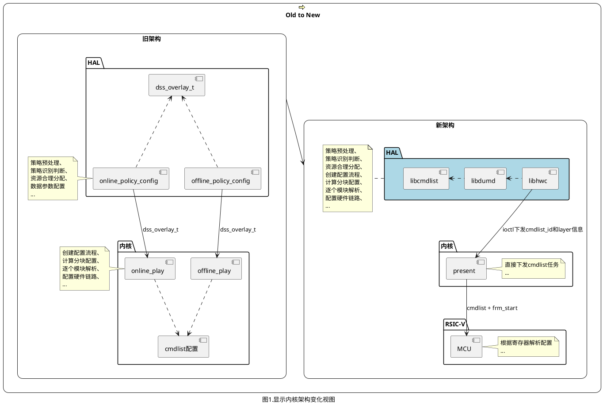
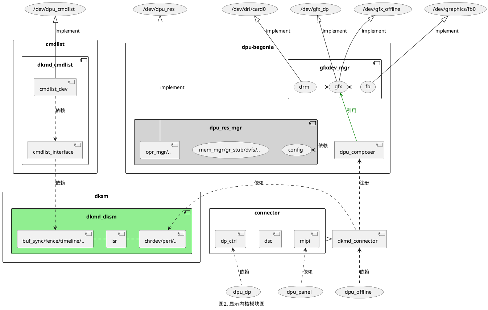
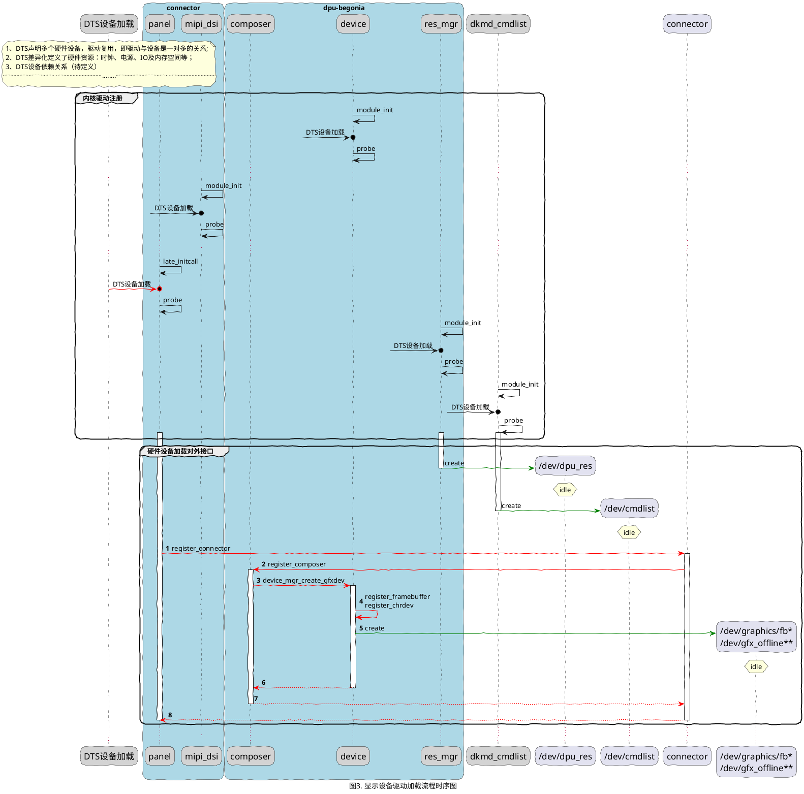

# DKMD系统软件设计说明书

## 修订记录

| 日期       | 修订版本 | 修改章节             | 修改描述 | 作者     |
| ---------- | -------- | -------------------- | -------- | -------- |
| 2021-02-18 | V0.1     | 梳理DKMD整体设计逻辑 | 初稿     | 00274020 |
| 2021-03-08 | V0.2     | 增加时序和流程逻辑   | 新增     | 00274020 |

- [DKMD系统软件设计说明书](#dkmd系统软件设计说明书)
  - [修订记录](#修订记录)
  - [1 显示内核驱动简介](#1-显示内核驱动简介)
  - [2 DKMD整体设计描述](#2-dkmd整体设计描述)
    - [2.1 DKMD软件系统模块说明](#21-dkmd软件系统模块说明)
    - [2.2 DKMD软件系统时序说明](#22-dkmd软件系统时序说明)

## 1 显示内核驱动简介

显示子系统重构设计的整体思路是为了不让芯片核心架构由于驱动代码开源而暴露，需要将驱动中更多的资源、策略以及链路链接关系等计算上移到HAL层，HAL层以库文件交付；
所以架构整体做了如下调整：

如上图可以看出几点核心变化：
**新架构的所有资源使用、策略匹配以及场景配置计算都是在HAL完成计算实现，内核驱动只做任务最后的提交执行。**

## 2 DKMD整体设计描述

驱动设计使用模块化编程思想，将各个模块依赖关系和接口梳理清楚后组合完成内核显示子系统搭建；
另外分为基础模块和扩展模块：
基础模块完成提供显示基本功能，属于A包范畴；
扩展模块是提供额外特性功能的模块，如局部刷新、低功耗调频、在线回写等，属于B包范畴。

虽然显示配置等复杂计算任务，在内核中不需要关注了，但仍然需要有相关设备驱动作为数据计算的基础，这些重要的模块有：

- Cmdlist模块驱动
- Panel模块驱动
- MIPI_DSI模块驱动
- Composer模块驱动
- FBDevice模块驱动
- DP模块驱动等

### 2.1 DKMD软件系统模块说明

除了基础内核驱动模块外，显示内核还有一些通用接口模块，他们与基础模块之间如下图所示：

每一个模块都有自己模块宏控制，在满足依赖的情况下，可以独立编译运行，他们之间的依赖关系如下表所示：

| 显示驱动目录    |           |          | 控制宏                     | 功能描述                            | 接口依赖关系                                       |
| --------------- | --------- | -------- | -------------------------- | ----------------------------------- | -------------------------------------------------- |
| kernel/.../dkmd |           |          | CONFIG_DKMD_ENABLE         | 控制编译显示整个驱动模块            | NA                                                 |
|                 | cmdlist   |          | CONFIG_DKMD_CMDLIST_ENABLE | 使能cmdlist驱动模块                 | CONFIG_DKMD_DKSM                                   |
|                 | connector |          | CONFIG_DKMD_DPU_CONNECTOR  | 使能connector模块                   | NA                                                 |
|                 |           | dp       | CONFIG_DKMD_DPU_DP         | dp模块使能                          | NA(TODO)                                           |
|                 |           | offline  | CONFIG_DKMD_DPU_OFFLINE    | offline模块使能                     | CONFIG_DKMD_DPU_COMPOSER                           |
|                 |           | panel    | CONFIG_DKMD_DPU_PANEL      | 屏模块使能                          | CONFIG_DKMD_DPU_CONNECTOR                           |
|                 | dksm      |          | CONFIG_DKMD_DKSM           | fence、timeline、buf_sync等接口函数 | NA                                                 |
|                 | dpu       |          | CONFIG_DKMD_DPU_ENABLE     | 使能DPU叠加驱动核心模块             | NA                                                 |
|                 |           | composer | CONFIG_DKMD_DPU_COMPOSER   | 叠加设备驱动模块                    | CONFIG_DKMD_CMDLIST_ENABLE CONFIG_DKMD_DPU_RES_MGR |
|                 |           | device   | CONFIG_DKMD_DPU_DEVICE     | 对外显示设备管理模块                | CONFIG_DKMD_DPU_COMPOSER                           |
|                 |           | res_mgr  | CONFIG_DKMD_DPU_RES_MGR    | 叠加资源管理模块                    | CONFIG_DKMD_DKSM                                   |
表1. 显示内核模块依赖表

### 2.2 DKMD软件系统时序说明

硬件设备信息通过DTS定义声明，加载解析设备信息流程依赖DTS的加载顺序；特别地，最后枚举出对外设备接口时，需要由输出设备来完成加载调用。
这里的输出设备通常有：屏（panel）送显、DP送显、离线写DDR；所以DTS设备信息需要在对外输出设备加载对齐接口设备前完成信息获取和解析，
然后由输出设备驱动完成链路调用与注册，最终完成对外设备的枚举。在设备被正常流程调用使用时，调用的接口作用刚好相反，
因此这个加载注册的调用流程，称之为：“反向注册”。如下为主屏（/dev/graphics/fb0）反向注册流程：

