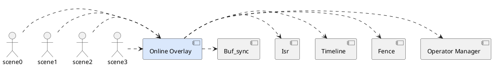
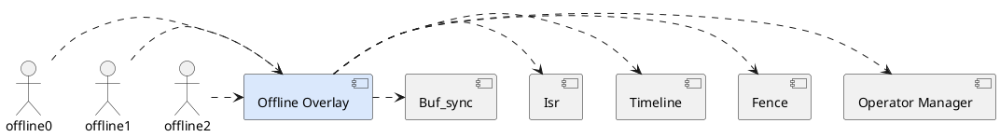
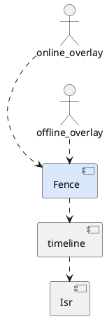
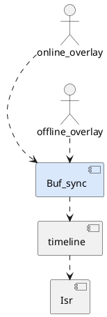
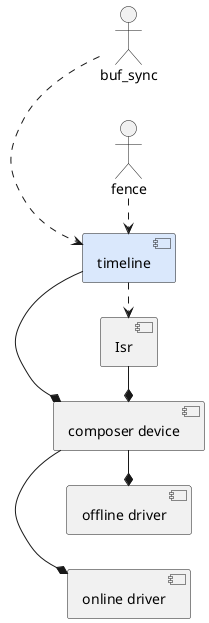
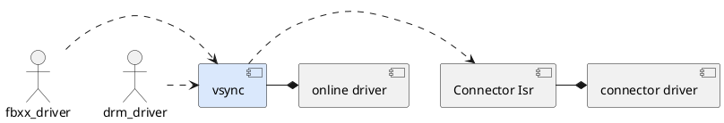
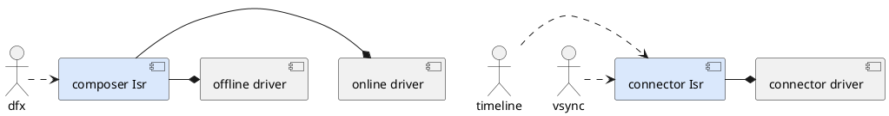
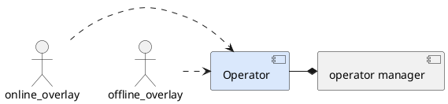
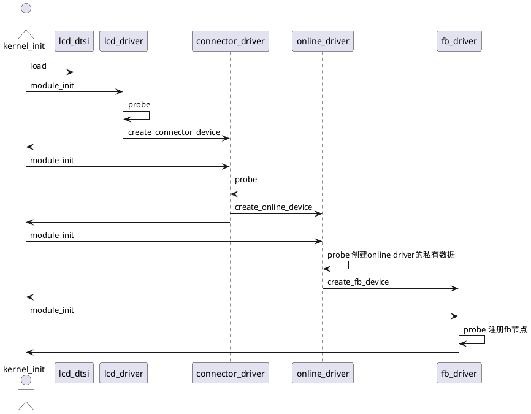

# Display Driver Composer模块 软件设计说明书

修订记录
|  日期     |修订版本|   修改章节   |修改描述| 作者              |  
|  ----    | ----   |    ----     | ----  |---                  | 
| 2020-9-10 | V0.1   | 1. 总体设计 | 初稿   | gongyu 00447686|

- [Display Driver Composer模块 软件设计说明书](#display-driver-composer模块-软件设计说明书)
  - [1. 简介](#1dot-简介)
  - [2.第零层设计描述](#2dot第零层设计描述)
    - [2.1	Composer Driver模块上下文定义](#2dot1composer-driver模块上下文定义)
      - [1 Composer Driver的输入](#1-composer-driver的输入)
      - [2 Composer Driver](#2-composer-driver)
      - [3 Composer Driver依赖的外部模块](#3-composer-driver依赖的外部模块)
    - [2.2 Composer Driver模块主要用例](#2dot2-composer-driver模块主要用例)
  - [3. 第一层设计描述](#3dot-第一层设计描述)
    - [3.1	总体结构](#3dot1总体结构)
      - [3.1.1	模块划分](#3dot11模块划分)
    - [3.2	分解描述](#3dot2分解描述)
      - [3.2.1	模块分解](#3dot21模块分解)
        - [1.	模块1 Online Driver描述](#1dot模块1-online-driver描述)
        - [2.	模块2 Offline Driver描述](#2dot模块2-offline-driver描述)
        - [3.	模块3 Online Overlay描述](#3dot模块3-online-overlay描述)
        - [4.	模块4 Offline Overlay描述](#4dot模块4-offline-overlay描述)
        - [5.	模块5 Fence描述](#5dot模块5-fence描述)
        - [6.	模块6 Buf_sync描述](#6dot模块6-buf_sync描述)
        - [7.	模块7 timeline描述](#7dot模块7-timeline描述)
        - [8.	模块8 Vsync描述](#8dot模块8-vsync描述)
        - [9.	模块9 Isr中断描述](#9dot模块9-isr中断描述)
        - [10.	模块10 Operator描述](#10dot模块10-operator描述)
  - [4. 模块1 Online Driver详细设计](#4dot-模块1-online-driver详细设计)
    - [4.1	online driver 驱动加载时序图](#4dot1online-driver-驱动加载时序图)
    - [4.2 Online Driver UML类图](#4dot2-online-driver-uml类图)
    - [4.2	UML活动图](#4dot2uml活动图)
  - [5. 模块2详细设计](#5dot-模块2详细设计)
    - [5.1	UML类图](#5dot1uml类图)
    - [5.2	UML活动图](#5dot2uml活动图)
    - [5.3	UML时序图](#5dot3uml时序图)
  - [6. 1层测试设计](#6dot-1层测试设计)

## 1. 简介
本模块是display driver的一部分，是display driver完成叠加功能的核心业务模块，需要根据输入的图层信息，完成在线或者离线叠加。

- 概念解释：
  - Scene：场景，是指DTE硬件定义的能支持在线叠加且最后走到外设的场景，例如Charlotte最大支持4个场景，也就是4路在线同时叠加，因此1个场景包括了两部分    
       Composer和Connector。这两部分是独立的，各自有各自的中断。分别对应Composer Driver和Connector Driver模块。

  - Composer Driver: 叠加器驱动模块, 作为scene的前端，完成对接各种显示框架，完成叠加功能。

- 缩写：   
  - comp: composer
  - disp: display

## 2.第零层设计描述
 [Display Driver Level0模块图](https://cloudmodeling.tools.huawei.com/projectspace/detail/2f39647d2a824d36b9d3c4f897f29f92?projectDiagramUUID=e356769823d449ec811c4caf1f184f2d&versionUUID=)


### 2.1	Composer Driver模块上下文定义   

```plantuml
  'Composer模块上下文
  @startuml
    left to right direction
    '外部输入
    actor  FBxx_driver
    actor  offline_driver
    actor  DRM_driver
    
    '暴露接口
    interface IComposer
    
    '本模块，#dae8fc是颜色
    package ComposerDriver #dae8fc{
      '[] 是方形的模块
      '() 是圆形模块
      [driver]
      [core]
      [utils]
      [operators]
    }
    '依赖接口
    interface IConnector
    interface IEffect
    interface IResourceManager
    interface IPowerManager

    '连接线 
    '    ->带箭头实线
    '   .>带箭头虚线
    '    - 实线，不带箭头
    '    . 虚线，不带箭头

    FBxx_driver -> IComposer
    offline_driver -> IComposer
    DRM_driver -> IComposer
    ComposerDriver .> IConnector
    ComposerDriver .> IEffect
    ComposerDriver .> IResourceManager
    ComposerDriver .> IPowerManager
    IComposer <|- ComposerDriver
  @enduml
  ```   
#### 1 Composer Driver的输入
  - 使用Framebuffer驱动框架进行在线叠加；   
  - 使用DRM驱动框架进行在线叠加
  - 使用Offline驱动接口完成离线叠加，包括copybit操作
#### 2 Composer Driver
  - driver层作为接口层，负责整改驱动链的加载和对外接口
  - core层核心功能是完成叠加，包括在线和离线叠加
  - utils主要是叠加过程中用到的公共小函数
  - Operators作为叠加功能的基础设施，最终叠加的配置，由各个算子完成
#### 3 Composer Driver依赖的外部模块
 - IConnector是指链接设备提供的接口，例如mipi, dp, edp等，composer driver的上下电需要调用IConnector的接口
 - IEffect主要是叠加过程需要与效果模块产生的交互，本来DPP已经作为Composer Driver中的一个算子，叠加过程的配置统一由算子模块管理，    
   但是与Effect模块的其他控制指令，例如之间的时序依赖的调用，需要通过IEffect接口调用
 - IResourceManager与Composer Driver的交互，主要是Resource Manager模块需要通过Composer Driver模块进行状态迁移，释放资源等操作
 - IPowerManager主要是Composer Driver的上下电流程需要调用Power Manager接口完成，例如灭屏情况下做离线叠加，    
   需要调用Power Manager模块接口，先对DPU进行上电，完成叠加后，调用接口下电。以及Composer Driver的低功耗特性操作电压和时钟，   
   需要通过Power Manager进行，因此需要由Power Manager模块进行统一的管理电压和时钟
 

### 2.2 Composer Driver模块主要用例  
这里输入系统的主要用例
```plantuml
  '上下文图实例
  @startuml
    left to right direction

    '外部用户
    actor  FBxx_driver
    actor  Offline_driver
    actor  DRM_driver

    '软件系统
    package ComposerDriver #dae8fc{
        '用例
        (单scene 在线叠加) as case_0        
        (单scene 在线叠加且回写)  as case_1
        (多scene 在线叠加并发) as case_2
        (单offline 离线叠加) as case_3
        (多offline 离线叠加并发) as case_4
        (单scene在线与单offline叠加并发) as case_5
        (多scene在线与多offline叠加并发) as case_6
        (在线回写与多offline叠加并发) as case_7
    }
    '用户与用例的关联
    FBxx_driver -> case_0
    FBxx_driver -> case_1
    FBxx_driver -> case_2
    
    DRM_driver -> case_0
    DRM_driver -> case_1    
    DRM_driver -> case_2

    Offline_driver ->case_3
    Offline_driver ->case_4
  
    case_0 ..|> case_5
    case_3 ..|> case_5
    case_2 ..|> case_6
    case_4 ..|> case_6
    case_1 ..|> case_7
    case_4 ..|> case_7
    
  @enduml
  ```  

## 3. 第一层设计描述

### 3.1	总体结构

[Level1 -- Composer Driver模块图](https://cloudmodeling.tools.huawei.com/projectspace/detail/2f39647d2a824d36b9d3c4f897f29f92?projectDiagramUUID=ec3470bc87be435dae5d70136cc0e110&versionUUID=)

![Level1 -- Composer Driver](https://cloudmodelingapi.tools.huawei.com/cloudmodelingdrawiosvr/d/Awz?t=1600311586755)

#### 3.1.1	模块划分
根据上图可知，composer driver可以分为驱动层，核心领域层，基础算子层，以及支撑公共工具层

### 3.2	分解描述
#### 3.2.1	模块分解
- 驱动层：用来实现composer driver模块的对外接口，与composer支持的叠加通路强相关。例如，charlotte上，DTE支持4个在线场景，3个离线通路，    
         因此需要支持7个驱动层实体，每个实体都有独立的数据空间。而每个平台支持哪些通路，在dts中定义。    
         在这一层，为了减少重复代码，抽象出两类驱动Online Driver, Offline Driver。可以认为是Online Driver, Offline Driver是两个类，最后会创建出7个实体。

- 核心领域层：指完成叠加需要的核心模块，包括在线叠加，离线叠加，fence, isr, buf_sync, timeline, vsync。

- 基础算子层：指完成叠加需要操作的基础硬件资源，叠加主要是由算子完成，因此，在这层，需要实现算子管理模块和各个算子的自身操作。
  
- 支撑层：指Composer Driver的各层用到的公共机制和小函数。

+ 模块划分：    
  模块1: Online Driver   
  模块2：Offline Driver    
  模块3：Online Overlay    
  模块4：Offline Overlay    
  模块5：Fence    
  模块6：Buf_sync    
  模块7：Timeline    
  模块8：Vsync    
  模块9：Isr中断    
  模块10：各个operator，包括SDMA等17种算子    

##### 1.	模块1 Online Driver描述
本模块功能主要是为了支持各个场景的对外接口，用在在线场景叠加。同时调用connector接口，完成上下电等流程

```plantuml
  'online driver 上下文图
  @startuml
    '外部用户
    left to right direction

    actor  FBxx_driver
    actor  DRM_driver

    interface IComposer

    '软件系统
    package Online_Driver #dae8fc {
      [composer device]
    }

    interface IConnector
    rectangle MIPI
    rectangle DP
    rectangle eDP
    rectangle DDIC

    FBxx_driver .> IComposer
    DRM_driver .> IComposer
    IComposer <|. Online_Driver
    Online_Driver .> IConnector
    IConnector <|. MIPI
    IConnector <|. DP
    IConnector <|. eDP
    IConnector <|. DDIC
    Online_Driver .> [Online Overlay]    
  @enduml
  ```  
##### 2.	模块2 Offline Driver描述
offline driver负责完成离线叠加的动作

```plantuml
  'offline driver 上下文图
  @startuml
    '外部用户
    actor  dev_offline0
    actor  dev_offline1
    actor  dev_offline2

    interface IComposer

    '软件系统
    package Offline_Driver #dae8fc {
      [composer device]
    }

    dev_offline0 .> IComposer
    dev_offline1 .> IComposer
    dev_offline2 .> IComposer
    IComposer <|. Offline_Driver
    Offline_Driver .> [Offline Overlay]    
  @enduml
```  



##### 3.	模块3 Online Overlay描述
Online Overlay模块为各个场景提供在线叠加配置流程，是支持多线程并发的，因此这里面的函数应该都是可重入的。



##### 4.	模块4 Offline Overlay描述
Offline Overlay模块主要完成离线叠加，支持多线程，需要支持可重入。



##### 5.	模块5 Fence描述
fence主要是用来处理release fence和retire fence，包括创建fence和signal fence，被用在叠加流程。



##### 6.	模块6 Buf_sync描述
buf_sync模块是指，为了防止用来叠加的dma_buf被用户态释放掉，需要在启动叠加前，增加dma_buf的计数，让上层不能释放掉这块buf，    
当不需要用这块buf时，减少dma_buf的计数，以此达到同步dma_buf的目的。


##### 7.	模块7 timeline描述
timeline模块为每个叠加场景创建一个timeline，用来为叠加流程做同步。而timeline需要与每个场景的中断关联。
composer device是online driver和offline driver都需要包含的数据结构。


由上图可知，buf_sync和fence模块会用到timeline，而timeline和isr都属于composer device的一部分。而每个scene driver和offline driver都有一个composer device

##### 8.	模块8 Vsync描述
每个scene都有自己的vsync，而vsync的来源来自每个scene的connector中断，并且通过fb driver或者drm driver上报到上层。


由上图可知，每个scene，也就是在线场景，都会用到vsync，而vsync需要与每个场景的connector中断建立联系。而vsync是每个scene的online driver的一部分。

##### 9.	模块9 Isr中断描述
每个scene都有自己的中断，包括composer的中断和connector的中断，而vsync的来源来自每个scene的connector中断，并且上报到上层。


##### 10.	模块10 Operator描述
对于Composer Driver来说，Operator是叠加流程需要操作的基础设施，而算子作为一个实体，有各种属性，在这个模块，只需要用到算子的compose属性。   
其他属性包括状态机，复用规则等属性。算子包括两个维度，算子类型，一共17种算子类型，每种类型有多个算子。


## 4. 模块1 Online Driver详细设计
### 4.1	online driver 驱动加载时序图
以scene0的online driver驱动加载链为例如下：
最开始从外设驱动开始，逐层往上创建platform device，依次是connector, online, fb。

对于charlotte，最多支持4个场景，因此最多有4条这样的加载链路。



### 4.2 Online Driver UML类图
online driver的核心数据结构是struct disp_composer_device，由于c语言的特点，不好画类关系图，这里只能描述数据结果。

```plantuml
  '模块图
  @startuml
    '模块
    interface disp_pipeline_ops {
      - int (*turn_on)(uint32_t id, struct platform_device *dev);
      - int (*turn_off)(uint32_t id, struct platform_device *dev);
      - int (*present)(uint32_t id, struct platform_device *dev, void *data);
    }

    package online_driver {
      enum {
        DISP_ISR_COMPOSER,
        DISP_ISR_CONNECTOR
        DISP_ISR_MAX
      }
      class disp_composer_device {
          struct disp_chrdev chrdev
          
          uint32_t scene_id
          struct comp_data_base *data
          
          struct disp_timeline timeline
          struct disp_isr *isr[DISP_ISR_MAX]
          
          struct disp_pm_regulator *regulators[MAX]
          struct disp_pm_clk *clks[MAX]

          struct comp_priv_ops *priv_ops
          const struct disp_panel_info *panel

          uint32_t next_dev_count
          struct comp_next_device nex_dev[MAX]
      }
      class comp_data_base {        
        - struct comp_workqueue worker
        - char *ip_base[MAX]        
      }
      class comp_data_offline {
        struct comp_data_base base
        
        '其他离线的数据
      }
    }
    
    class disp_timline
    class disp_isr
    
    disp_pipeline_ops <|. online_driver
    disp_timline -* disp_composer_device
    comp_data_base -* disp_composer_device
    disp_isr -* disp_composer_device
    disp_pm_regulator -o disp_composer_device
    disp_pm_clk -o disp_composer_device
    comp_data_offline -|> comp_data_base
  
  @enduml
  ```  
  - struct disp_composer_device，作为online_driver的核心数据结构，每个在线场景和离线都有一个这样的数据结构。
  - struct comp_data_base， 作为每个具体driver的私有数据空间的父类，这里用指针指向真实的空间，每个driver需要自己申请属于自己的数据空间，并且继承自这个类。   
        例如有些数据是只用在offline_driver，有些是只用在scene2_driver的，放在这里。
  - struct disp_timeline，每个driver都需要，主要用在做同步上，例如layerbuf和fence的同步。如果离线是串行的话，不需要，如果是并行的，就需要timeline。具体实现，将在下面章节介绍
  - struct disp_isr，描述了每个中断相关的信息，对于一个scene来说，包括两个部分，一个是叠加，一个是传输，因此也包括两个中断，一个是叠加通路上的中断，一个是connector报上来的中断，例如DSI。   
                     其中特殊的是，connector的中断虽然是connector报的，但是这个中断与叠加流程强耦合，因此放在这里维护。   
                     对于离线来说，就只有一个叠加通路上的中断，也就是WCH上的中断。
### 4.2	UML活动图

```plantuml
'UML活动图
@startuml
'开始
start
'活动，以 :开始  ;结束
:prepare;
:rm device;
:validate display;
:travesal layers\nget needed operators;
repeat
    :get operator needed;
    :resource manager check availablity;
    if(operator available?) then (yes)
        :add into network;
    else (no)
        if(operator reusable available?) then(yes)
            :add into network;
        else(no)        
            :GPU合成;
            :break;
            stop
        endif
    endif
repeat while(more operator needed?)
stop
  @enduml
  ```  


## 5. 模块2详细设计
### 5.1	UML类图
### 5.2	UML活动图
### 5.3	UML时序图

## 6. 1层测试设计
